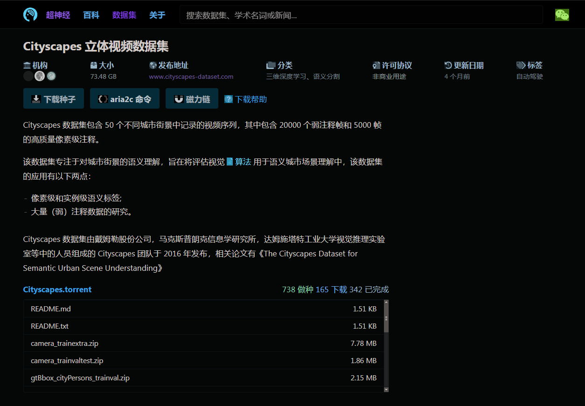

# PSG

PyTorch implementation of [DeepLabV3](https://arxiv.org/abs/1706.05587), trained on the [Cityscapes](https://www.cityscapes-dataset.com/) dataset.


## 数据集下载

## cityscapes

> Cityscapes数据集由戴姆勒股份公司，马克斯普朗克信息学研究所，达姆施塔特工业大学视觉推理实验室等中的人员组成的 Cityscapes 团队于 2016 年发布，相关论文有《The Cityscapes Dataset for Semantic Urban Scene Understanding》数据集包含 50 个不同城市街景中记录的视频序列，其中包含 20000 个弱注释帧和 5000 帧的高质量像素级注释。

- 该数据集专注于对城市街景的语义理解，旨在将评估视觉  算法 用于语义城市场景理解中，该数据集的应用有以下两点：
	- 像素级和实例级语义标签; 
	- 大量（弱）注释数据的研究。



### aria2

支持多种协议的命令行下载神器，能尽量拉满带宽（~~pan.baidu.com/s/whatfuck~~），还特么支持断点续传，再也不受chrome的气！

- 项目仓库在`https://github.com/aria2/aria2`，在release页下载适用于你系统的最新版，如[aria2-1.35.0-windows-x64](https://github.com/aria2/aria2/releases/download/release-1.35.0/aria2-1.35.0-win-64bit-build1.zip)

- 下载完成后用7-Zip提取到当前位置，在本仓库下新建`data`文件夹，新建复制**aria2c.exe**到`data`z中，<kbd>Shift</kbd>+鼠标右键，`在此处打开Powershell窗口(S)`，粘贴以下命令（感谢数据集做种的网站，虽然100M的光纤我还是下了一整夜）

```sh
aria2c.exe -c -j16 -s16 -x16 --follow-torrent=mem -o 'hyperai.torrent' 'https://hyper.ai/tracker/download?torrent=7106'
```

- 下载完成后的文件及说明：

| 文件名 | 大小 | 说明 |
| --- | --- | --- |
| README.md	| 1.51 KB | 
| README.txt	| 1.51 KB | 
| camera_trainextra.zip	| 7.78 MB | 
| camera_trainvaltest.zip	| 1.86 MB | 
| gtBbox_cityPersons_trainval.zip	| 2.15 MB | 行人边界框注释，无用 |
| gtCoarse.zip	| 1.23 GB | 粗略注释，用于所有训练和验证图像以及另一组19998张训练图像（train_extra） |
| gtFine_trainvaltest.zip	| 240.87 MB | 精细注释，2975张训练图，500张验证图和1525张测试图 |
| leftImg8bit_blurred.zip	| 10.7 GB | 面部和牌照模糊 |
| leftImg8bit_demoVideo.zip | 	6.5 GB | 8位LDR格式的左侧图像，视频抽帧 |
| leftImg8bit_trainextra.zip	| 43.99 GB | 扩充 |
| leftImg8bit_trainvaltest.zip	| 10.8 GB | 常规划分 |
| vehicle_trainextra.zip	| 7.64 MB | 车辆测距，GPS坐标和室外温度 |
| vehicle_trainvaltest.zip	| 1.82 MB |  |
| samples_0.png	| 1.65 MB | |
| samples_1.png	| 1.61 MB | |
| samples_2.png	| 1.81 MB | |

### 预处理

- 用7-Zip把`gtFine_trainvaltest.zip`和`leftImg8bit_trainvaltest.zip`提取到当前位置，再将`leftImg8bit_demoVideo.zip`解压后移至`leftImg8bit`文件夹下，执行如下命令，*(仅需执行一次)*

```python
python utils/preprocess_data.py
```
- 完成后的`data`目录结构树如下

```sh
├─data
│  └─cityscapes
│      ├─gtFine
│      │  ├─test
│      │  │  ├─berlin
│      │  │  ├─bielefeld
│      │  │  ├─bonn
│      │  │  ├─leverkusen
│      │  │  ├─mainz
│      │  │  └─munich
│      │  ├─train
│      │  │  ├─aachen
│      │  │  ├─bochum
│      │  │  ├─bremen
│      │  │  ├─cologne
│      │  │  ├─darmstadt
│      │  │  ├─dusseldorf
│      │  │  ├─erfurt
│      │  │  ├─hamburg
│      │  │  ├─hanover
│      │  │  ├─jena
│      │  │  ├─krefeld
│      │  │  ├─monchengladbach
│      │  │  ├─strasbourg
│      │  │  ├─stuttgart
│      │  │  ├─tubingen
│      │  │  ├─ulm
│      │  │  ├─weimar
│      │  │  └─zurich
│      │  └─val
│      │      ├─frankfurt
│      │      ├─lindau
│      │      └─munster
│      ├─leftImg8bit
│      │  ├─demoVideo
│      │  │  ├─stuttgart_00
│      │  │  ├─stuttgart_01
│      │  │  └─stuttgart_02
│      │  ├─test
│      │  │  ├─berlin
│      │  │  ├─bielefeld
│      │  │  ├─bonn
│      │  │  ├─leverkusen
│      │  │  ├─mainz
│      │  │  └─munich
│      │  ├─train
│      │  │  ├─aachen
│      │  │  ├─bochum
│      │  │  ├─bremen
│      │  │  ├─cologne
│      │  │  ├─darmstadt
│      │  │  ├─dusseldorf
│      │  │  ├─erfurt
│      │  │  ├─hamburg
│      │  │  ├─hanover
│      │  │  ├─jena
│      │  │  ├─krefeld
│      │  │  ├─monchengladbach
│      │  │  ├─strasbourg
│      │  │  ├─stuttgart
│      │  │  ├─tubingen
│      │  │  ├─ulm
│      │  │  ├─weimar
│      │  │  └─zurich
│      │  └─val
│      │      ├─frankfurt
│      │      ├─lindau
│      │      └─munster
│      └─meta
│          └─label_imgs
```

## 模型

- deeplabv3_resnet18

### Train model on Cityscapes:

```python
python train.py
```

<table>
  <tr>
    <td vlign="center">
        
    </td>
    <td vlign="center">
        
    </td>
  </tr>
</table>

## 性能评估

### evaluation/eval_on_val_for_metrics.py:

- $ python evaluation/eval_on_val_for_metrics.py 

```sh
pip install -i https://pypi.tuna.tsinghua.edu.cn/simple cityscapesScripts
```

#### 添加环境变量

- 

- 或者在cmd(<kbd>win + r</kbd> -> cmd)中键入如下命令(自行修改)
```sh
set CITYSCAPES_RESULTS=%CITYSCAPES_RESULTS%;D:\PSG\training_logs\val_result
set CITYSCAPES_DATASET=%CITYSCAPES_DATASET%;D:\PSG\data\cityscapes
```

```sh
C:\>csEvalPixelLevelSemanticLabeling.exe
Evaluating 500 pairs of images...
Images Processed: 500

classes          IoU      nIoU
--------------------------------
road          : 0.930      nan
sidewalk      : 0.713      nan
building      : 0.839      nan
wall          : 0.412      nan
fence         : 0.396      nan
pole          : 0.385      nan
traffic light : 0.424      nan
traffic sign  : 0.569      nan
vegetation    : 0.860      nan
terrain       : 0.486      nan
sky           : 0.875      nan
person        : 0.625    0.480
rider         : 0.444    0.255
car           : 0.896    0.764
truck         : 0.580    0.277
bus           : 0.610    0.409
train         : 0.312    0.133
motorcycle    : 0.322    0.168
bicycle       : 0.575    0.408
--------------------------------
Score Average : 0.592    0.362
--------------------------------


categories       IoU      nIoU
--------------------------------
flat          : 0.943      nan
construction  : 0.848      nan
object        : 0.465      nan
nature        : 0.872      nan
sky           : 0.875      nan
human         : 0.645    0.509
vehicle       : 0.868    0.748
--------------------------------
Score Average : 0.788    0.629
--------------------------------
```

## Documentation of remaining code

- model/resnet.py:
- - Definition of the custom Resnet model (output stride = 8 or 16) which is the backbone of DeepLabV3.

- model/aspp.py:
- - Definition of the Atrous Spatial Pyramid Pooling (ASPP) module.

- model/deeplabv3.py:
- - Definition of the complete DeepLabV3 model.

- utils/preprocess_data.py:
- - Converts all Cityscapes label images from having Id to having trainId pixel values, and saves these to data/cityscapes/meta/label_imgs. Also computes class weights according to the [ENet paper](https://arxiv.org/abs/1606.02147) and saves these to data/cityscapes/meta.

- utils/utils.py:
- - Contains helper funtions which are imported and utilized in multiple files. 

- datasets.py:
- - Contains all utilized dataset definitions.
